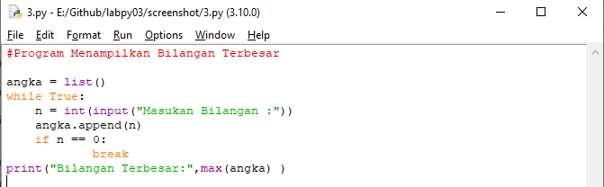
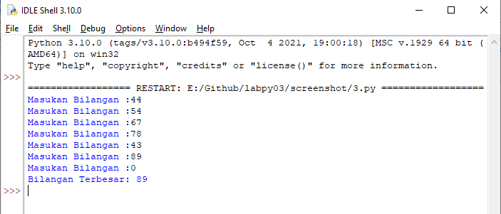
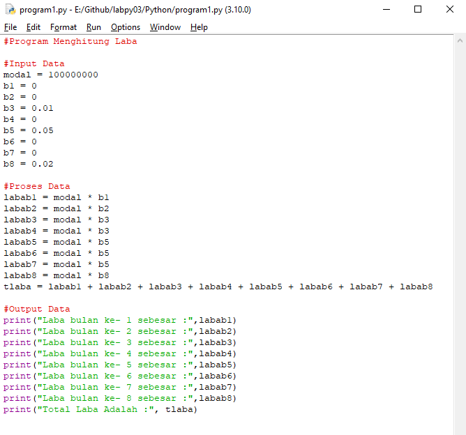
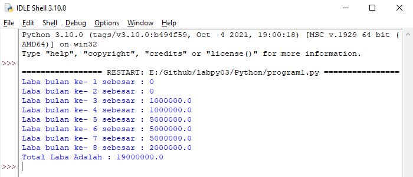

# labpy03

- Program Menampilkan Bilangan Acak dengan Jumlah yang di Inputkan

Ini adalah code pyhton saya
Menggunakan for in dan range

Dan ini adalah hasil output dari Program di atas

-----------------------------------------------------------------

- Program Menampilkan Bilangan Terbesar dari Bilangan yang di Inputkan

Ini adalah code pyhton saya
Menggunakan while untuk perulangan tanpa batas dan break untuk keluar dari perulangan while tersebut.

Dan ini adalah hasil output dari Program di atas

-----------------------------------------------------------------

- Program Menghitung Laba Dari Investasi

Ini adalah code pyhton saya
Code sederhana dengan perhitungan menjadi variabel, menggunakan data yang ada

Dan ini adalah hasil output dari Program di atas

-----------------------------------------------------------------